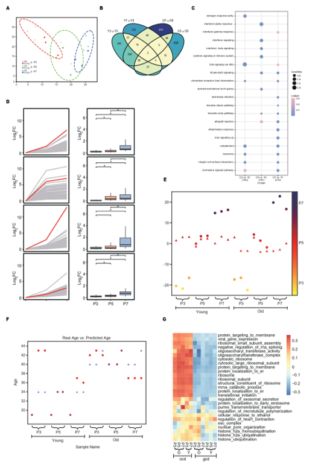
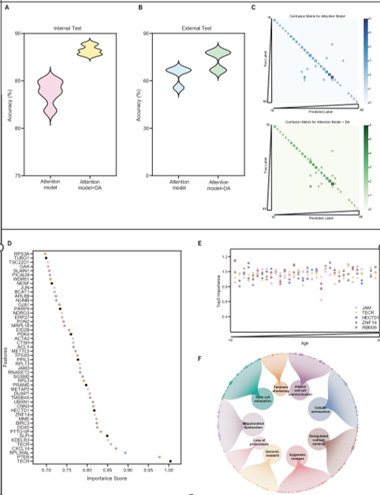

# GAPE
In this study, we aim to develop a tool to predict endometrial age and generate corresponding transcriptomic data according to age, to help estimate endometrial aging and function and generate corrected data. 
 
Paper is Under Reviewing...
 
  
 
  
  
 
